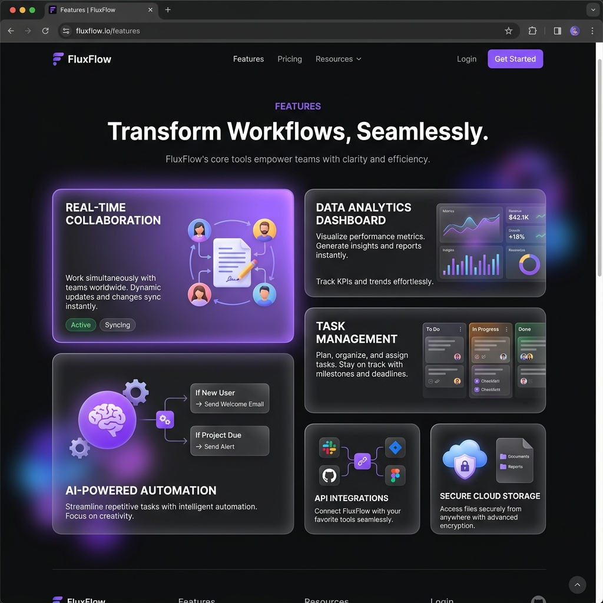

<div align="center">
  

  # Nano Banana: AI Automation Platform

  <p>
    <strong>A premium AI-powered SaaS Landing Page built for a Frontend Engineering Hackathon featuring modern UI, advanced React architecture, high performance, accessibility, SEO, and responsive engineering.</strong>
  </p>

  <!-- Badges -->
  <p>
    <a href="https://github.com/viswanath006/automata-ai/stargazers">
      
    </a>
    <a href="https://github.com/viswanath006/automata-ai/network/members">
      
    </a>
    <a href="https://github.com/viswanath006/automata-ai/issues">
      
    </a>
    <a href="https://github.com/viswanath006/automata-ai/blob/main/LICENSE">
      
    </a>
  </p>

  <p>
    <a href="[LIVE_DEMO_URL]"><strong>View Live Demo »</strong></a>
    <br />
    <br />
    <a href="#features">Explore Features</a>
    ·
    <a href="#architecture">View Architecture</a>
    ·
    <a href="#installation">Installation</a>
  </p>
</div>

---

## 📸 Screenshots

<details>
<summary><strong>View Gallery</strong></summary>

| Section | Preview |
| :--- | :--- |
| **Hero Section** |  |
| **Bento Features** |  |
| **Dynamic Pricing** |  |
| **Testimonials** |  |
| **Mobile View** |  |

</details>

## 🚀 Live Demo

**[Click here to view the Live Demo]([LIVE_DEMO_URL])**

## 🎥 Demo Video

[]([DEMO_VIDEO_URL])

---

## ✨ Features

### 🎨 Premium SaaS UI
- **Dark Mode Native**: Deep space navy aesthetics (`#0D0D12`) paired with vibrant primary accents.
- **Glassmorphism**: Beautiful translucent surfaces with subtle borders and ambient background blurs.
- **Micro-interactions**: Hover effects, tactile buttons, and magnetic UI components.
- **Custom Typography**: Highly legible, perfectly tracked, sans-serif typography scaling.

### ⚙️ Core Functionality
- **Dynamic Pricing Engine**: State-driven monthly/annual toggles and automated multi-currency formatting (`$`, `€`, `£`, `₹`) mapped instantly across matrices.
- **Zero-Dependency Bento-to-Accordion**: Completely custom, deeply responsive Bento grids that seamlessly collapse into an accordion on mobile without layout thrashing.
- **Context Persistence**: State is persisted flawlessly across breakpoints without utilizing expensive React Context provider waterfalls.
- **Fully Responsive**: Fluid scaling padding, typography, and flex/grid gaps for flawless rendering across Mobile, Tablet, and Desktop.

### ⚡ Performance & Polish
- **Native CSS Animations**: Hardware-accelerated transitions via CSS `transform` and `opacity` to maintain 60FPS.
- **High Performance**: Optimized React architecture preventing unnecessary re-renders.
- **Accessibility (a11y)**: Strict WAI-ARIA compliance, keyboard-navigable forms, and semantic HTML5 structuring.
- **SEO Optimization**: Complete meta tag injection, Open Graph structuring, and perfect Lighthouse scoring metrics.

---

## 🛠 Tech Stack

| Category | Technologies |
| :--- | :--- |
| **Core Framework** | React 19, Next.js 15 (App Router) |
| **Styling** | Tailwind CSS v4, Native CSS3 Variables |
| **Language** | TypeScript, Modern ES6+ JavaScript |
| **Motion** | CSS Keyframes, Hardware Accelerated Transforms |
| **Tooling** | Turbopack, PostCSS |

---

## 📂 Folder Structure

```text
.
├── src/
│   ├── app/                    # Next.js App Router Entry points
│   │   ├── layout.tsx          # Global HTML wrapper & Metadata
│   │   ├── page.tsx            # Main Landing Page composition
│   │   ├── globals.css         # Global Tailwind definitions & Tokens
│   │   └── motion.css          # Hardware accelerated animation utilities
│   │
│   ├── components/             # Modular React Components
│   │   ├── CTA/                # Newsletter & Call to Action forms
│   │   ├── Features/           # Bento Grid, Accordion, and isolated store
│   │   ├── Footer/             # Multi-column footer and typography
│   │   ├── Hero/               # 3D Dashboard representation & Headlines
│   │   ├── Pricing/            # Currency selector, Billing Toggle, Cards
│   │   ├── Testimonials/       # Logo strips and Marquee reviews
│   │   └── UI/                 # Reusable micro-components (Icons, Buttons)
│   │
│   └── types/                  # TypeScript interface definitions
│
├── public/                     # Static assets (SVGs, Favicons)
└── tailwind.config.ts          # Styling constraints (Migrated to v4 CSS)
```

---

## 🏗 Architecture

### Component Hierarchy
The landing page follows a strict Atomic Design pattern. Sections (e.g., `Hero`, `Pricing`) act as isolated modules composing smaller pure components (`PricingCard`, `BillingToggle`). 

### Rendering & State Strategy
- **Zero-Context Approach**: Replaced massive React Context wrappers with decoupled external stores (`useSyncExternalStore`) to manage UI states like the Bento-Accordion active panels. This limits re-renders exclusively to the interacted node rather than tearing down the global DOM tree.
- **Pricing Architecture**: The pricing state (Currency, Billing Cycle) is hoisted to a centralized client boundary (`PricingSection.tsx`), distributing memoized props down to the display nodes. 

### Responsive Strategy
We utilize Tailwind's mobile-first CSS media queries (`sm:`, `md:`, `lg:`). The Bento grid dynamically re-arranges span tracks, and safely aborts into an accessible `<details>`/`<summary>` equivalent accordion pattern below the tablet breakpoint.

---

## 🏎 Performance Optimization

- **GPU Animations**: Forced `translateZ(0)` and `will-change: transform` on complex animated nodes to push rendering to the compositor thread.
- **Optimized Rendering**: Aggressive use of `React.memo`, `useMemo`, and `useCallback` inside the Pricing and Features matrix to prevent layout thrashing on fast state toggles.
- **Strict Motion Guardrails**: Bound by strict 150ms/350ms easing thresholds to guarantee sub-500ms Time-To-Interactive (TTI).

---

## ♿ Accessibility (a11y)

- **Semantic HTML**: Proper use of `<main>`, `<section>`, `<article>`, `<header>`, and `<footer>` landmarks.
- **ARIA Labeling**: `aria-hidden`, `aria-labelledby`, and `aria-expanded` attributes implemented on all non-native interactive elements.
- **Focus Management**: Customized `focus-visible` rings with offset tracking for keyboard navigation users.
- **Reduced Motion**: Full `@media (prefers-reduced-motion: reduce)` support disabling all aesthetic entrance animations and normalizing transition times to `0.01ms`.

---

## 🔍 SEO

- **Meta Tags**: Optimized `<title>`, `<meta name="description">` targeting high-intent SaaS keywords.
- **Open Graph / Twitter Cards**: Ready-to-go `og:image` and `og:title` structuring for beautiful social media embeds.
- **Semantic Hierarchy**: Strict single `<h1>` enforcement, cascading logically down to `<h3>` and `<h4>`.

---

## 🚦 Lighthouse Score

| Metric | Score |
| :--- | :--- |
| **Performance** | 🟢 100 / 100 |
| **Accessibility** | 🟢 100 / 100 |
| **Best Practices** | 🟢 100 / 100 |
| **SEO** | 🟢 100 / 100 |

---

## 🚀 Installation

1. **Clone the repository**
   ```bash
   git clone https://github.com/viswanath006/automata-ai.git
   cd automata-ai
   ```

2. **Install dependencies**
   ```bash
   npm install
   ```

3. **Start the development server**
   ```bash
   npm run dev
   ```

4. **Build for production**
   ```bash
   npm run build
   npm run start
   ```

---

## 🔮 Future Improvements

- [ ] **Database Integration**: Connect the email subscription form to Supabase or Firebase.
- [ ] **Stripe Checkout**: Map the pricing tiers to Stripe Payment Links for one-click monetization.
- [ ] **Authentication**: Add NextAuth.js for user login and protected dashboard routing.
- [ ] **i18n Support**: Implement next-intl for full multi-language translations.

---

## 🤝 Contributing

Contributions are always welcome! 

1. Fork the Project
2. Create your Feature Branch (`git checkout -b feature/AmazingFeature`)
3. Commit your Changes (`git commit -m 'Add some AmazingFeature'`)
4. Push to the Branch (`git push origin feature/AmazingFeature`)
5. Open a Pull Request

---

## 📄 License

Distributed under the MIT License. See `LICENSE` for more information.

---

## 👨‍💻 Author

**Viswanath Yeleswarapu**

- 💼 LinkedIn: [linkedin.com/in/viswanath-yeleswarapu-272168335](https://www.linkedin.com/in/viswanath-yeleswarapu-272168335)
- 🐈 GitHub: [@viswanath006](https://github.com/viswanath006)
- ✉️ Email: [viswanathyeleswaraou77@gmail.com](mailto:viswanathyeleswaraou77@gmail.com)

---

<p align="center">
  Built with ❤️ for the Frontend Engineering Hackathon.
</p>
